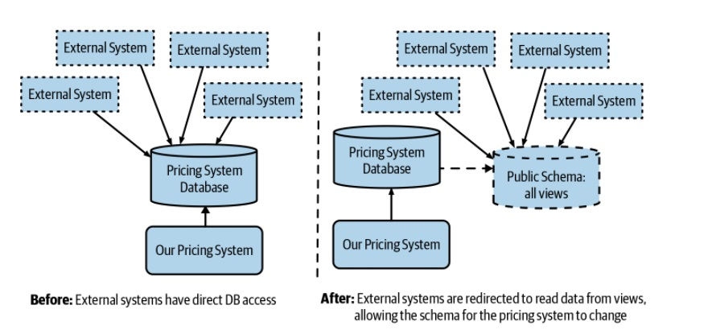
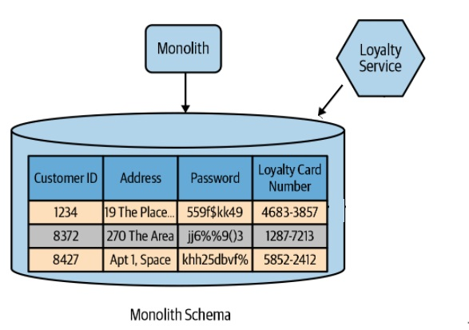
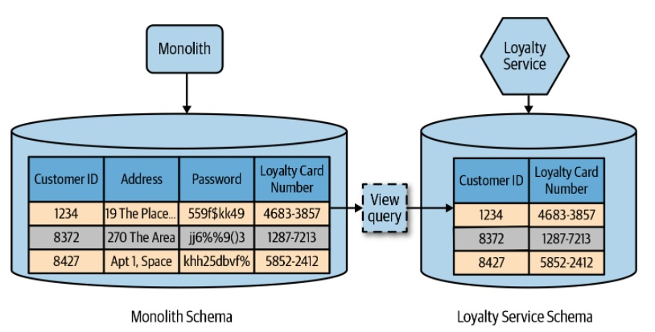

# Database View

## Introduction
In a situation where we want a single source of data for multiple services, a view can be used to mitigate the concerns regarding coupling. With a view, a service can be presented with a schema that is a limited projection from an underlying schema. This projection can limit the data that is visible to the service, hiding information it shouldn’t have access to.

## The Database as a Public Contract

## Limitations 

- It's important to see the impact on performance of the views (cache vs online query)
- There are database engines that only support read-only views

## Where to Use It

- Should be avoided as much as possible
- There are times when other services cannot be updated to use a service and need to access directly to the database

## Our Example

This is a very simple SpringBoot project to manage customers. We can find, add, update or delete customers. We use JPA like ORM for storing, accessing, and managing Java objects in a Mysql database.

- In the v1, we have two independents services (Monolith & Loyalty Service) both of them accesing to the same repository (Monolith schema). From the "Monolith Service", I can execute CRUD operations while from the "Loyalty Service", I can only execute read operations. The "Monolith Schema" has an USER table with four fields: ID, ADDRESS, PASSWORD, LOYALTY_CARD_NUMBER. When the application start, we are going to insert some data in the user table.

- In the v2, we have two microservices (monolith and loyaltyService) where both of them get data from different database schemas (Monolith Schema and Loyalty Service Schema). The user information required by "Loyalty Service" is not found in "Loyalty Service Schema", but we have a view on table T_USER of "Monolith Schema" from "Loyalty Service".  

'
 
       CREATE or replace VIEW loyalty.t_loyalty_card_number_view AS 
       SELECT id AS id, loyalty_card_number AS loyalty_card_number 
       FROM monolith.t_user;

## Deployment

We are going to user a Docker compose file to deploy the examples: 

- In the v1 version we are going to deploy the database, and the v1 of the monolith and the loyalty service. Both services  will be hosted on dockerhub and will be deploy with a docker-compose file:

     version: '3.9'

        services:
        monolith:
        image: juaneb/database_view_monolith_v1
        ports:
        - 8080:8080
        environment:
        # Enviroment variables for connect to MySQL
        - MYSQL_HOST=mysql
        depends_on:
        - mysql
        restart: on-failure
    
        loyaltyservice:
        image: juaneb/database_view_loyalty_v1
        ports:
        - 8090:8090
        environment:
        - MYSQL_HOST=mysql
        restart: on-failure
    
        mysql:
        image: mysql:8.0.25
        ports:
        - 3306:3306
        environment:
        # Enviroment variables for securize MySQL and create default Database
        - MYSQL_DATABASE=monolith
        - MYSQL_ROOT_PASSWORD=pass
        volumes:  
        - ./mysql_db:/var/lib/mysql
        restart: always

- In the v2 version we are going to deploy the database, and the v2 of the monolith and the loyalty service. Both services  will be hosted on dockerhub and will be deploy with a docker-compose file:

'

    version: '3.9'
        services:
        monolith:
        image: juaneb/database_view_monolith_v2
        ports:
        - 8080:8080
        environment:
        # Enviroment variables for connect to MySQL
        - MYSQL_HOST=mysql
        depends_on:
        - mysql
        restart: on-failure
        
        loyaltyservice:
        image: juaneb/database_view_loyalty_v2
        ports:
        - 8090:8090
        environment:
        - MYSQL_HOST=mysql
        depends_on:
        - mysql
        - monolith
        restart: on-failure
        
        mysql:
        image: mysql:8.0.25
        ports:
        - 3306:3306
        environment:
        # Enviroment variables for securize MySQL and create default Database
        - MYSQL_DATABASE=monolith
        - MYSQL_ROOT_PASSWORD=pass
        volumes:
        - ./mysql_db:/var/lib/mysql
        restart: always

Both services uses mysql as database, whose tables are created by hibernate in the startup. We are going to use flyway to deploy the view in the V2 of loyalty service.

To start the example we will use:

' 

    docker-compose up

