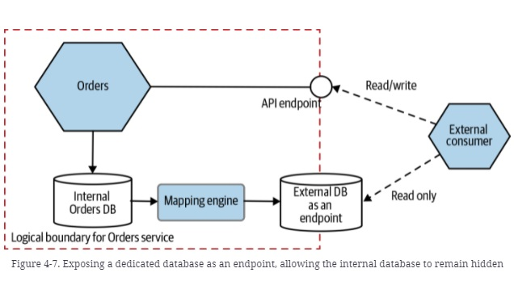
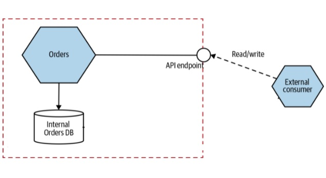
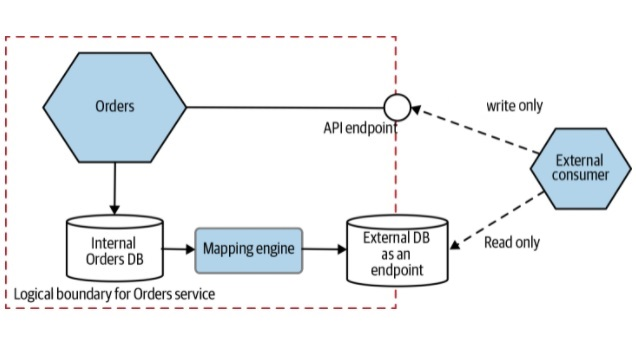

# Database-as-a-Service Interface

## Introduction
Sometimes, clients just need a database to query. In these situations, allowing clients to view data that your service manages in a database can make sense, but we should take care to separate the database we expose from the database we use inside our service boundary. One approach is to create a dedicated database designed to be exposed as a read-only endpoint, and have this database populated when the data in the underlying database changes. In effect, in the same way that a service could expose a stream of events as one endpoint, and a synchronous API as another endpoint, it could also expose a database to external consumers.

- The report database is synchronized
- Named “Reporting database” by Fowler
- One way to implement CQRS

## Impementation 

- CDC (Change data capture) services
- Batch updating

[Debezium](https://debezium.io/)

## Comparison with views

- More flexible
- Allows different database engines
- More complex transformations
- But at a cost...

## Our Example

This is a very simple SpringBoot project to manage orders. We can find, add, update or delete orders. We use JPA like ORM for storing, accessing, and managing Java objects in a Mysql database.

- In the v1, we have two services, (Order Service and an external consumer service) The "Order Service" can execute CRUD operations while from the "External Consumer Service" can read and write data from API endpoint from the "Order service".  The "Order Schema" has an ORDER table with four fields: DATE_ORDER, PURCHASER, ADDRESS, TOTAL_PRICE to register the orders.

- In the v2, we have two services, (Order Service and an external consumer service). We have an external consumer that write data from API endpoint from the Order service and read data from the external DB repository. The Internal Order DB and the External DB are syncronized by a CDC (Debezium). For this case, we are going to synchronize two mysql databases and the Orders table.

## Deployment

We are going to user a Docker compose file to deploy the examples: 

- In the v1 version we are going to deploy the database, and the v1 of the order and the externalconsumer service. Both services  will be hosted on dockerhub and will be deploy with a docker-compose file:

'

	version: '3.9'
	services:
		order:
			image: dreyg/database_as_a_service_order_v1
			ports:
			- 8080:8080
			environment:
			# Enviroment variables for connect to MySQL
			- MYSQL_HOST=mysql
			depends_on:
			- mysql
			restart: on-failure

		externalconsumer:
			image: dreyg/database_as_a_service_external_consumer_v1
			ports:
			- 8090:8090
			environment:
			- HOST=order
			restart: on-failure

		mysql:
			image: mysql:8.0.25
			ports:
			- 3306:3306
			environment:
			# Enviroment variables for securize MySQL and create default Database
			- MYSQL_DATABASE=order
			- MYSQL_ROOT_PASSWORD=pass
			volumes:
			- ./mysql_db:/var/lib/mysql
			restart: always

- In the v2 version we are going to deploy Debezium (zookeper, kafka and connector service), two database (mysqlproducer, mysqlsuscriber) and de v2 version of the order and the externalconsumer service. All services  will be hosted on dockerhub and will be deploy with a docker-compose file:

'

    version: '3.9'
	services:
	mysqlproducer:
		image: mysql:8.0.25
		ports:
		- 3306:3306
		environment:
		# Enviroment variables for securize MySQL and create default Database
		- MYSQL_DATABASE=order
		- MYSQL_ROOT_PASSWORD=pass
		volumes:
		- ./mysql_db_producer:/var/lib/mysqlproducer
		restart: always

	zookeeper:
		image: debezium/zookeeper:1.7
		ports:
		- 2181:2181
		- 2888:2888
		- 3888:3888
		restart: on-failure

	kafka:
		image: debezium/kafka:1.7
		ports:
		- 9092:9092
		environment:
		- ZOOKEEPER_CONNECT=zookeeper:2181
		- HOST_NAME=kafka
		depends_on:
		- zookeeper
		restart: on-failure

	mysqlsuscriber:
		image: mysql:8.0.25
		ports:
		- 3307:3306
		environment:
		# Enviroment variables for securize MySQL and create default Database
		- MYSQL_DATABASE=order
		- MYSQL_ROOT_PASSWORD=pass
		volumes:
		- ./mysql_db_suscriber:/var/lib/mysqlsuscriber
		restart: always

	connector:
		image: debezium/connect:1.7
		ports:
		- 8083:8083
		environment:
		- BOOTSTRAP_SERVERS=kafka:9092
		- GROUP_ID=2
		- CONFIG_STORAGE_TOPIC=my_connect_configs
		- OFFSET_STORAGE_TOPIC=my_connect_offsets
		- STATUS_STORAGE_TOPIC=my_connect_statuses
		depends_on:
		- mysqlproducer
		- mysqlsuscriber
		- zookeeper
		- kafka
		restart: on-failure

	order:
		image: juaneb/database_as_a_service_order_v2
		ports:
		- 8080:8080
		environment:
		# Enviroment variables for connect to MySQL
		- MYSQL_HOST=mysqlproducer
		depends_on:
		- mysqlproducer
		- mysqlsuscriber
		- zookeeper
		- kafka
		restart: on-failure

	externalconsumer:
		image: juaneb/database_as_a_service_external_consumer_v2
		ports:
		- 8090:8090
		environment:
		- MYSQL_HOST=mysqlsuscriber
		- HOST=order
		- BROKER_HOST=kafka
		depends_on:
		- mysqlproducer
		- mysqlsuscriber
		- zookeeper
		- kafka
		restart: on-failure

We need configre the connector to syncronize both databases (mysqlproducer and mysqlsuscriber). We consume the connector API:

  curl -i -X POST -H "Accept:application/json" -H "Content-Type:application/json" localhost:8083/connectors/ -d @conector-mysql.json

The conector-mysql.json has the configuration for the connector:

'
{
  "name": "database-as-a-service-connector",
  "config": {
    "connector.class": "io.debezium.connector.mysql.MySqlConnector",
    "tasks.max": "1",
    "database.hostname": "mysqlproducer",
    "database.port": "3306",
    "database.user": "root",
    "database.password": "pass",
    "database.server.id": "184054",
    "database.server.name": "dbserver1",
    "database.include.list": "order",
    "database.history.kafka.bootstrap.servers": "kafka:9092",
    "database.history.kafka.topic": "schema-changes.order"
  }
}

To start the example we will use:

' 

    docker-compose up