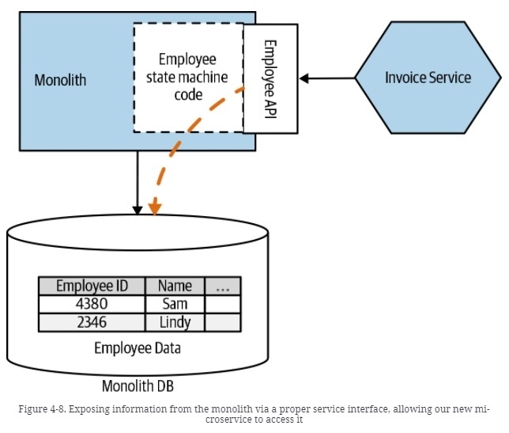
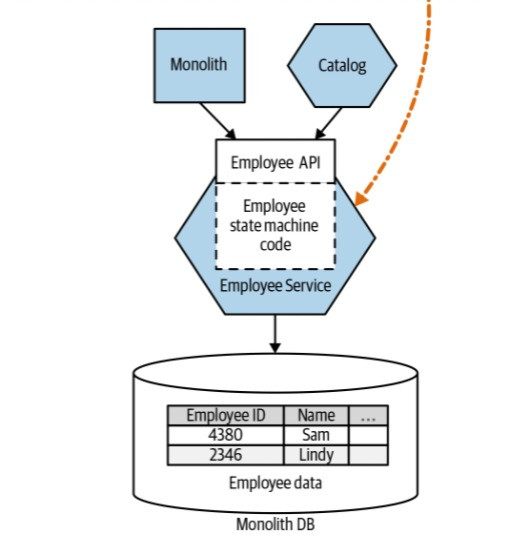

# Aggregate Exposing Monolith

## Introduction
In Figure 4-8, our new Invoicing service needs to access a variety of information that isn’t directly related to managing invoicing. At the very least, it needs information on our current Employees to manage approval workflows. This data is currently all inside the monolith database. By exposing information about our Employees via a service endpoint (it could be an API or a stream of events) on the monolith itself, we make explicit what information the Invoice service needs.

## Expose an aggregate with API

- It is not simply to export the database
- The aggregate management service is exported
- The life cycle of this data begins to be controlled
- It is a previous step to extracting that API to your own microservice in the future

## Where to Use It

-  When you need to access the monolith data because they have not yet been extracted
- It is a preliminary step to the new reasonable microservice
- In general it is much better than using views
- It cannot be used if the monolith cannot / will not change

## Our Example

This is a very simple SpringBoot project to manage Employee Data. We can find, add, update or delete employee data. We use JPA like ORM for storing, accessing, and managing Java objects in a Mysql database.

- In the v1, we have an Invoice Service get Employee Data from the Monolith DB through an employee endpoint. From the endpoint, I can execute CRUD operations. The "Monolith Schema" has an EMPLOYEE table with four fields: BIRTH_DATE, DOCUMENT, LAST_NAME, NAME. When the application start, we are going to insert some data in the employee table.

- In the v2, the employee data is exposed by the Employee Service. All the services that need employee data get the data through the Employee API

## Deployment

We are going to user a Docker compose file to deploy the examples: 

- In the v1 version we are going to deploy the database, and the v1 of the monolith and the invoice service. Both services  will be hosted on dockerhub and will be deploy with a docker-compose file:

'

    version: '3.9'
    services:
        mysql:
            image: mysql:8.0.25
            ports:
            - 3306:3306
            environment:
            # Enviroment variables for securize MySQL and create default Database
            - MYSQL_DATABASE=monolith
            - MYSQL_ROOT_PASSWORD=pass
            volumes:
            - ./mysql_db:/var/lib/mysql
            restart: always
        monolith:
            image: juaneb/aggregate_exposing_monolith_monolith_v1
            ports:
            - 8080:8080
            environment:
            # Enviroment variables for connect to MySQL
            - MYSQL_HOST=mysql
            depends_on:
            - mysql
            restart: on-failure
        invoiceservice:
            image: juaneb/aggregate_exposing_monolith_invoice_v1
            ports:
            - 8090:8090
            environment:
            - MYSQL_HOST=mysql
            - HOST=monolith
            restart: on-failure

- In the v2 version we are going to deploy the database, and the v2 of the monolith, employee and the catalog service. All services  will be hosted on dockerhub and will be deploy with a docker-compose file:

'

    version: '3.9'
    services:
        mysql:
            image: mysql:8.0.25
            ports:
            - 3306:3306
            environment:
            # Enviroment variables for securize MySQL and create default Database
            - MYSQL_DATABASE=employee
            - MYSQL_ROOT_PASSWORD=pass
            volumes:
            - ./mysql_db:/var/lib/mysql
            restart: always   

        employee:
            image: juaneb/aggregate_exposing_monolith_employee_v2
            ports:
            - 8080:8080
            environment:
            - MYSQL_HOST=mysql        
            restart: on-failure

        monolith:
            image: juaneb/aggregate_exposing_monolith_monolith_v2
            ports:
            - 8090:8090
            environment:
            # Enviroment variables for connect to MySQL
            - MYSQL_HOST=mysql
            - HOST=employee
            depends_on:
            - mysql
            restart: on-failure

        catalog:
            image: juaneb/aggregate_exposing_monolith_catalog_v2
            ports:
            - 8100:8100
            environment:
            # Enviroment variables for connect to MySQL
            - MYSQL_HOST=mysql
            - HOST=employee
            depends_on:
            - mysql
            restart: on-failure

To start the example we will use:

' 

    docker-compose up