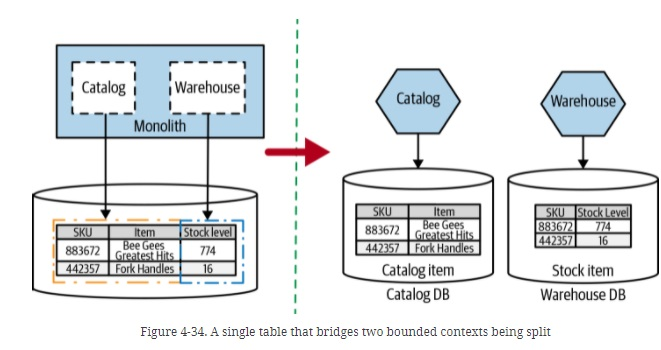
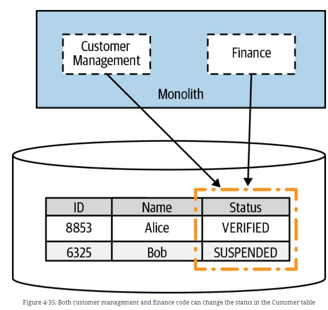

# Split Table

## Introduction
Sometimes you’ll find data in a single table that needs to be split across two or more service boundaries, and that can get interesting. In Figure 4-34, we see a single shared table, Item, where we store information about not only the item being sold, but also the stock levels.

## The problem
What happens when multiple pieces of code update the same column? In Figure 4-35, we have a Customer table, which contains a Status column.

This column is updated during the customer sign-up process to indicate that a given person has (or hasn’t) verified their email, with the value going from NOT_VERIFIED → VERIFIED. Once a customer is VERIFIED, they are able to shop. Our finance code handles suspending customers if their bills are unpaid, so they will on occasion change the status of a customer to SUSPENDED. In this instance, a customer’s Status still feels like it should be part of the customer domain model, and as such it should be managed by the soon-to-be-created Customer service. Remember, we want, where possible, to keep the state machines for our domain entities inside a single service boundary, and updating a Status certainly feels like part of the state machine for a customer! This means that when the service split has been made, our new Finance service will need to make a service call to update this status, as we see in Figure 4-36.

## Where to Use It

On the face of it, these seem pretty straightforward. When the table is owned by two or more bounded contexts in your current monolith, you need to split the table along those lines. If you find specific columns in that table that seem to be updated by multiple parts of your codebase, you need to make a judgment call as to who should “own” that data. Is it an existing domain concept you have in scope? That will help determine where this data should go.

## Our Example

This is a very simple SpringBoot project to manage the customer's status.  We use JPA like ORM for storing, accessing, and managing Java objects in a Mysql database.

- In the v1, we have a monolith with two controllers (finance and cutomer) to change the status of the customer. The "Customer Managment Schema" has an CUSTOMER table with 3 fields: ID, NAME, STATUS. When the application start, we are going to insert some data in the customer table.

- In the v2, we have two services (customer and finance). The only service that can change the customer status directly is the customer managment service. The finance service has to pass through the Customer Managment service.

## Deployment

We are going to user a Docker compose file to deploy the examples: 

- In the v1 version we are going to deploy the database, and the v1 of the monolith. The monolith will be hosted on dockerhub and will be deploy with a docker-compose file:

'

    version: '3.9'
    services:
    mysql:
        image: mysql:8.0.25
        ports:
        - 3306:3306
        environment:
        # Enviroment variables for securize MySQL and create default Database
        - MYSQL_DATABASE=order
        - MYSQL_ROOT_PASSWORD=pass
        volumes:
        - ./mysql_db:/var/lib/mysql
        restart: always

    monolith:
        image: juaneb/split_table_monolith_v1
        ports:
        - 8080:8080
        environment:
        # Enviroment variables for connect to MySQL
        - MYSQL_HOST=mysql
        depends_on:
        - mysql
        restart: on-failure

- In the v2 version we are going to deploy the database, and the v2 of the customer an finance service. All services  will be hosted on dockerhub and will be deploy with a docker-compose file:

'

    version: '3.9'
    services:
    mysql:
        image: mysql:8.0.25
        ports:
        - 3306:3306
        environment:
        # Enviroment variables for securize MySQL and create default Database
        - MYSQL_DATABASE=customer
        - MYSQL_ROOT_PASSWORD=pass
        volumes:
        - ./mysql_db:/var/lib/mysql
        restart: always

    customer:
        image: juaneb/split_table_customer_v2
        ports:
        - 8080:8080
        environment:
        # Enviroment variables for connect to MySQL
        - MYSQL_HOST=mysql
        depends_on:
        - mysql
        restart: on-failure

    finance:
        image: juaneb/split_table_finance_v2
        ports:
        - 8090:8090
        environment:
        - MYSQL_HOST=mysql
        - HOST=customer
        restart: on-failure

To start the example we will use:

' 

    docker-compose up